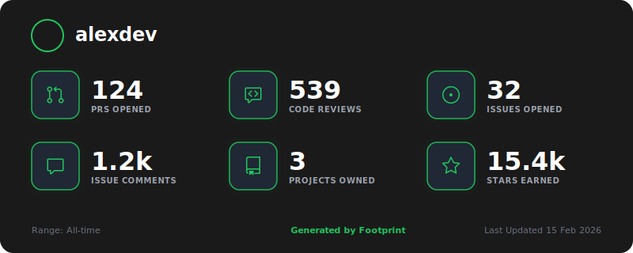
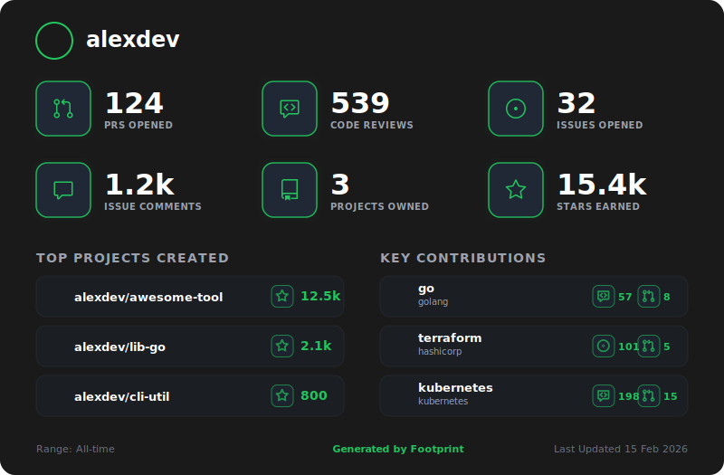

# Footprint

[](https://github.com/marketplace/actions/oss-footprint) [](https://github.com/arayofcode/footprint/actions/workflows/ci.yml) [](LICENSE)

**Footprint is an OSS contributions impact scoring engine** that discovers your public GitHub contributions, scores them by real impact, and generates portfolio-ready artifacts — SVG cards, a structured JSON report, and a Markdown summary.

It goes beyond raw commit or PR counts. Contributions are weighted by type, boosted if merged, scaled by repository popularity, and decayed for repetitive low-effort activity. The card is a projection of that model.


---

## How Scoring Works

Every contribution earns a base score:

| Contribution       | Base Score |
| ------------------ | ---------- |
| Pull Request       | 10.0       |
| Issue              | 5.0        |
| Code Review        | 3.0        |
| Issue Comment      | 2.0        |
| Discussion         | 2.0        |
| Discussion Comment | 2.0        |
| Review Comment     | 1.0        |

Three modifiers are applied:

- **Merged PR Bonus** — merged PRs receive a `1.5×` multiplier on their base score, applied before popularity.
- **Repo Popularity Multiplier** — each repo's score is scaled by `1 + log10(1 + stars + 2×forks)`, capped at `4.0×`. Forks are weighted 2× as a higher-intent adoption signal. The log scale prevents star-heavy repos from overwhelming everything else.
- **Diminishing Returns** — comment-type contributions (issue comments, review comments, PR comments, discussion comments) decay per repo using `1.0 / (1.0 + 0.5 × count)`. The first comment scores at 1.0×, the second at 0.66×, the third at 0.5×, and so on. Consistent engagement is valued; pure volume is not.

---

## Card Variants

| Variant          | Stats         | Sections                           | Hides zeros |
| ---------------- | ------------- | ---------------------------------- | ----------- |
| Standard         | All           | —                                  | No          |
| Minimal          | Non-zero only | —                                  | Yes         |
| Extended         | All           | Owned projects + top contributions | No          |
| Extended Minimal | Non-zero only | Owned projects + top contributions | Yes         |

| Standard                                   | Minimal                                  |
| ------------------------------------------ | ---------------------------------------- |
|  |  |

| Extended                                   | Extended Minimal                                           |
| ------------------------------------------ | ---------------------------------------------------------- |
|  |  |

---

## GitHub Action Usage

Add this workflow to any repository — typically your `username/username` profile repo:

```yaml
# .github/workflows/footprint.yml
name: Generate Footprint

on:
    schedule:
        - cron: "0 0 * * 0" # Weekly on Sunday
    workflow_dispatch:

permissions:
    contents: write # Required to push artifacts to output branch

jobs:
    generate:
        runs-on: ubuntu-latest
        steps:
            - name: Checkout
              uses: actions/checkout@v4

            - name: Generate Footprint
              uses: arayofcode/footprint@v1
              env:
                  GITHUB_TOKEN: ${{ secrets.GITHUB_TOKEN }}
```

The default `GITHUB_TOKEN` is sufficient. No PAT required.

### Inputs

| Input           | Default               | Description                                                                                                                          |
| --------------- | --------------------- | ------------------------------------------------------------------------------------------------------------------------------------ |
| `gh_token`      | `${{ github.token }}` | GitHub token for API access                                                                                                          |
| `username`      | `GITHUB_ACTOR`        | GitHub username to profile (defaults to the repo owner)                                                                              |
| `output_branch` | `footprint-output`    | Branch where generated artifacts are committed                                                                                       |
| `output_dir`    | `dist`                | Local output directory inside the container                                                                                          |
| `min_stars`     | `0`                   | Minimum star count for a project to appear in card sections. Does not affect aggregate stats — all owned projects are always counted |
| `card`          | `true`                | Generate SVG card variants                                                                                                           |
| `timeout`       | `300`                 | Timeout for GitHub API operations in seconds. Raise this for prolific contributors                                                   |

### Outputs

| Output                 | Description                                        |
| ---------------------- | -------------------------------------------------- |
| `total_contributions`  | Count of discovered external contributions         |
| `owned_projects_count` | Count of owned projects meeting the star threshold |
| `total_score`          | Aggregate weighted impact score                    |

### Generated Artifacts

Artifacts are committed to `output_branch` after each run:

| File                        | Description                                                            |
| --------------------------- | ---------------------------------------------------------------------- |
| `card.svg`                  | Standard card — all stats                                              |
| `card-minimal.svg`          | Minimal card — non-zero stats only                                     |
| `card-extended.svg`         | Extended card — stats + repo sections                                  |
| `card-extended-minimal.svg` | Extended minimal — non-zero stats + sections                           |
| `report.json`               | Full structured scoring data (schema versioned)                        |
| `summary.md`                | Human-readable impact summary, also written to the Actions job summary |

---

## Embedding in Your Profile README

### Markdown

```markdown

```

### HTML (with link)

```html
<a href="https://github.com/<username>/<repo>">
    /<repo>/footprint-output/card-extended.svg"
        alt="Footprint"
        width="800"
    />
</a>
```

> [!TIP]
> Replace `<username>/<repo>` with the repository where you added the workflow (e.g. `arayofcode/arayofcode`). The branch is `footprint-output` by default.

---

## Local Usage

```bash
export GITHUB_TOKEN=your_token
go run ./cmd/footprint -username <github_username>
```

Optional flags:

| Flag         | Default        | Description                      |
| ------------ | -------------- | -------------------------------- |
| `-username`  | `GITHUB_ACTOR` | GitHub username                  |
| `-min-stars` | `0`            | Minimum stars for owned projects |
| `-output`    | `dist`         | Output directory                 |
| `-timeout`   | `300s`         | API timeout                      |
| `-card`      | `true`         | Generate SVG cards               |

---

## Architecture

Footprint is a pipeline, not a badge service. The same scoring engine that populates `report.json` drives the card. Nothing is computed at render time.

```
fetch → classify → score → aggregate → render → write
```

**Pipeline laws enforced in code:**

- `logic/aggregator.go` owns all score multiplication. Renderers and fetchers never compute scores.
- Renderers consume finalized output models only — no re-derivation.
- `DecideLayout` is a pure function: same inputs always produce the same geometry.
- Decay ordering is deterministic: events are sorted chronologically before decay is applied, with URL as a stable tiebreaker.

**Fetch sources** (all via GitHub GraphQL):

- PRs authored (`author:<user> -user:<user> type:pr`)
- PRs reviewed (`reviewer:<user> -user:<user> type:pr`)
- Issues authored (`author:<user> -user:<user> type:issue`)
- Issue comments (`user.issueComments`, paginated, private repos excluded)

---

Contributions welcome. See [CONTRIBUTING.md](CONTRIBUTING.md).
